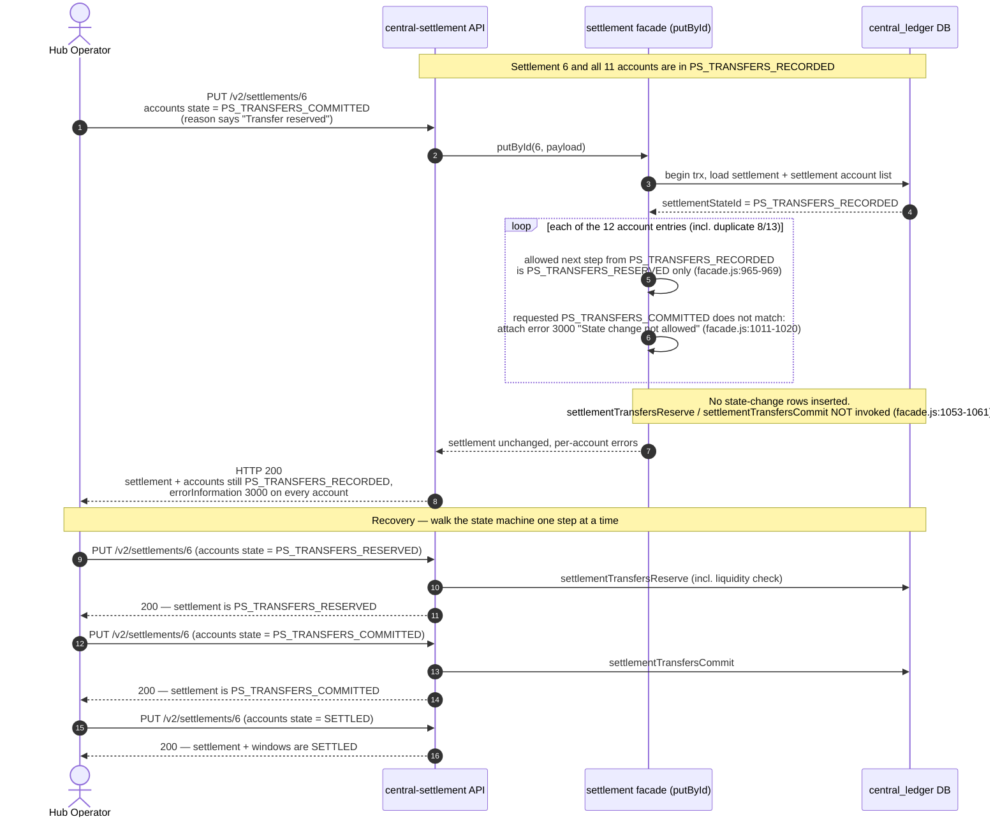

# Troubleshooting: Settlement "stuck" after PUT — error 3000 "State change not allowed"

**Date:** 2026-07-09
**Environment:** dev Mojaloop deployment
**Service:** central-settlement — `PUT /v2/settlements/{id}`
**Settlement:** id `6`, currency PHP, 11 participant accounts
**Reported as:** "stuck at the reserved settlement state" ([request/response gist](https://gist.github.com/akosipc/8d3dd235e38133a2bac360b64bbdeccb))

## TL;DR

This is not a stuck settlement and not a service bug. The PUT tried to jump two steps in the settlement state machine: settlement 6 is in `PS_TRANSFERS_RECORDED`, and the request asked every account to move straight to `PS_TRANSFERS_COMMITTED`, skipping `PS_TRANSFERS_RESERVED`. The service only accepts one specific next step per settlement state, so it rejected every account with error `3000 – State change not allowed` and left the settlement exactly where it was.

**Fix:** re-send the same payload with `"state": "PS_TRANSFERS_RESERVED"`, then `"state": "PS_TRANSFERS_COMMITTED"`, then `"state": "SETTLED"` — one step at a time.

## What the response tells us

- HTTP status was **200**, but every account carries `errorInformation: 3000 – "Generic client error - State change not allowed"`.
- The settlement-level `state` and every account `state` echo `PS_TRANSFERS_RECORDED` — the settlement is one step **before** "reserved", not at it.
- The request body says `"reason": "Transfer reserved"` but `"state": "PS_TRANSFERS_COMMITTED"` — it looks like the reserve-step request was reused with the wrong state value.
- Nothing was written: a rejected account produces no state-change row, and since every account was rejected, the settlement and all accounts are untouched.

## Sequence diagram



## Root cause

The service validates each account's requested state against the **settlement-level** state, and only accepts one specific next step (`src/models/settlement/facade.js:965-969`):

| Settlement is in | Only allowed account target |
|---|---|
| `PENDING_SETTLEMENT` | `PS_TRANSFERS_RECORDED` |
| `PS_TRANSFERS_RECORDED` | `PS_TRANSFERS_RESERVED` ← settlement 6 is here |
| `PS_TRANSFERS_RESERVED` | `PS_TRANSFERS_COMMITTED` ← the request asked for this |
| `PS_TRANSFERS_COMMITTED` / `SETTLING` | `SETTLED` |

Anything else falls through to the else branch at `facade.js:1011-1020`, which returns exactly what the response shows: error `3000 – State change not allowed` per account, with the account's current state echoed back.

The skipped step isn't a formality. When the settlement model has `autoPositionReset` enabled, each transition drives a ledger action (`facade.js:1053-1061`):

- recording runs `settlementTransfersPrepare`
- reserving runs `settlementTransfersReserve` (including the liquidity check)
- committing runs `settlementTransfersCommit`

Committing without reserving would skip the reservation of the settlement transfers, which is why the state machine hard-blocks the jump.

The settlement-level state only advances once **all** accounts have reached the next state (`facade.js:1174-1198`) — e.g. it becomes `PS_TRANSFERS_RESERVED` when the last account is reserved, and `SETTLING` while only some accounts are `SETTLED`.

## How to get unstuck

No cleanup is needed — the failed PUT changed nothing. Run the steps in order against the same endpoint (`PUT /v2/settlements/6`):

1. **Reserve** — resend the payload with `"state": "PS_TRANSFERS_RESERVED"` for all accounts (reason e.g. "Transfers reserved"). Settlement moves to `PS_TRANSFERS_RESERVED` once every account is reserved.
2. **Commit** — same payload with `"state": "PS_TRANSFERS_COMMITTED"`. Settlement moves to `PS_TRANSFERS_COMMITTED`.
3. **Settle** — same payload with `"state": "SETTLED"`. Settlement goes to `SETTLED` (or `SETTLING` while only some accounts are settled), and the windows flip to `SETTLED` as well.

```json
{
  "participants": [
    {
      "id": 3,
      "accounts": [
        { "id": 3, "reason": "Transfers reserved", "state": "PS_TRANSFERS_RESERVED" }
      ]
    }
  ]
}
```

(Repeat for all 11 unique accounts — and drop the duplicate entry, see below.)

## Two things to fix in the request while you're at it

- **Duplicate entry**: participant 8 / account 13 appears twice in the payload. This time both copies got the same error (a rejected account isn't marked as processed), but on the corrected retry the first copy will succeed and the second will come back with `"Account already processed once"` (`facade.js:936-944`). That's cosmetic — the state change from the first copy stands — but drop the duplicate; and if this payload is script-generated, the duplicate suggests the generator is emitting one entry per window/transfer instead of per settlement account.
- **Don't trust the HTTP status**: this endpoint returns 200 even when every account fails — errors are reported per account in `errorInformation`. If you're automating this, check each account's `errorInformation` (or follow up with `GET /v2/settlements/6`) rather than the status code.

## Code references

| Location | What it does |
|---|---|
| `src/models/settlement/facade.js:965-969` | Allowed state transitions (validated against settlement-level state) |
| `src/models/settlement/facade.js:1011-1020` | Rejection path — error 3000 "State change not allowed" |
| `src/models/settlement/facade.js:936-944` | "Account already processed once" (duplicate entries) |
| `src/models/settlement/facade.js:1053-1061` | Ledger actions per step (`settlementTransfersPrepare` / `Reserve` / `Commit`) |
| `src/models/settlement/facade.js:1174-1198` | Settlement-level state advance (incl. `SETTLING` / `SETTLED`) |
